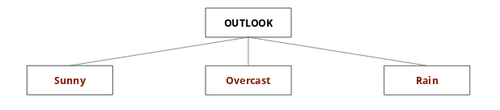
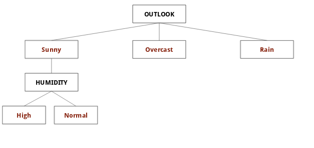
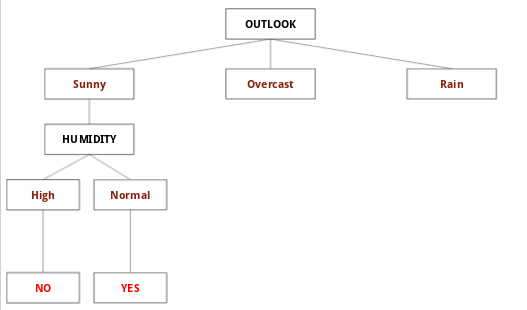
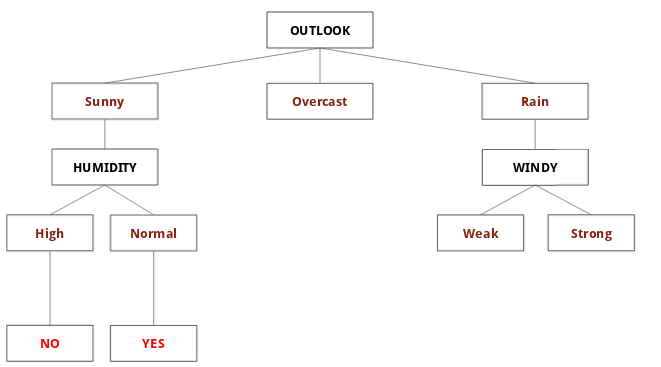
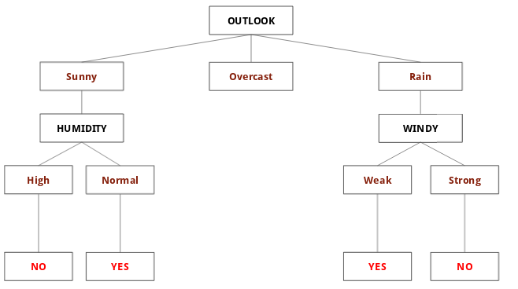
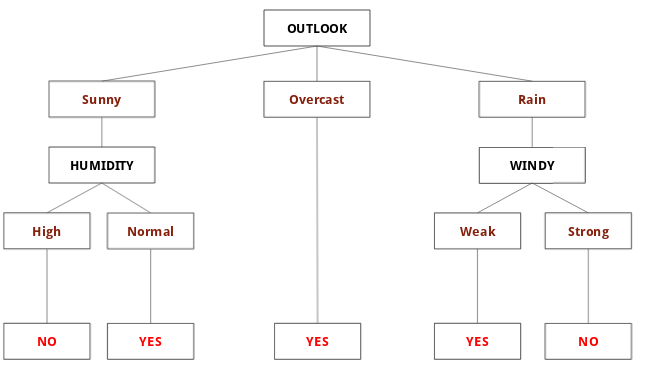

<h1 align="center"> DECISION TREE</h1>

<h2 align="center" id="0_2"> This repository is directed to the algorithms</h2>

 

### SUMÁRIO

 - [Introdução](#1)
 - [Conceitos básicos](#2)
 - [Fórmulas usadas](#3)
 - [Exemplo prático](#4)
 - [Algoritmos existentes]()

<!-- 
 - [Estatística I](./01-Estatistica_1/#0_1)
 - [Estatística II](./02-Estatistica_2/#0_1)
 - [Regressão Linear](./03-Regressao_linear/#0_1)
 - [Regressão Logística](./04-Regressao_logistica/#0_1)
 - [Séries Temporais](./05-Series_temporais/#0_1)
 - [Machine Learning](./06-Machine_learning/#0_1)
 - [Neural Networks e Deep Learning](./07-Neural_networks_e_deep_learning/#0_1)
 - [Grafos](./08-Grafos/#0_1)
 - [Mineração de Texto e processamento de linguagem natural](./09-Mineracao_texto_e_linguagem_natural/#0_1)
 - [Banco de Dados e Linguagem SQL](./10-Banco_de_dados_sql_e_noSql/#0_1)
 - [Fundamentos de gestão de projetos](./11-Fundamentos_de_gestao_de_projetos/#0_1) -->

 
<h1 align="center" id="1"> INTRODUÇÃO</h1>
 

 - A técnica de árvore de decisão consiste em mapear os possíveis resultados a partir de uma série de escolhas.

 - O algoritmo de árvore de decisão é aplicado para classificação ou regressão.

 - Se baseia na estratégia de dividir e conquistar.

 
<h1 align="center" id="2"> CONCEITOS BÁSICOS</h1>
 

A árvore é constituída por 4 características:

**Raiz:** É o atributo inicial da árvore, no qual tem o maior ganho de informação.

**Ramo:** São as possibilidade de decisão com base no atributo.

**Nó:** É representado pelo próximo atributo com maior ganho de informação.

**Folhas:** São as decisões finais, a classificação.

 
<h1 align="center" id="3">FÓRMULAS USADAS</h1>
 

<h3> ENTROPIA </h3>

Usado para medir o ganho de informação, o nível de ordem no produto.

A entropia de um conjunto pode ser definida como sendo o grau de pureza desse conjunto. Este conceito emprestado pela Teoria da Informação define a medida de "falta de informação", mais precisamente o número de bits necessários, em média, para representar a informação em falta, usando codificação óptima.

Dado um conjunto S, com instâncias pertencentes à classe i, com probabilidade pi, temos:

  

<!-- colocar grafico dos valores que a entropia pode atingir -->

<h3> GANHO DE INFORMAÇÃO </h3>

O ganho (gain) é define a redução na entropia. Ganho(S,A) significa a redução esperada na entropia de S, ordenando pelo atributo A. O ganho é dado pela seguinte equação:

<!-- EXPLICAR MAIS DEPOIS -->

 
<h1 align="center" id="4">EXEMPLO PRÁTICO</h1>
 

Aqui veremos um exemplo real onde será demonstrado todos os passos feitos pela técnica *árvore de decisão*.

O problema consiste em sem saber se as condições climáticas estão propícias para jogar Tênis (**target: *PLAY TENNIS***), será um problema de **classificação** com base no histórico de dias no qual deram ou não para jogar tênis. A seguir temos a tabela:

  

**1° passo: Buscar qual é o atributo com maior ganho para ser a "Raiz" da árvore**

Inicialmente verificar qual o entropia da classe/target **PLAY TENNIS**:

<table>  
  <tr>
    <th>Entropia geral</th>
  </tr>
  <tr>
    <td>S = [9+, 5-]</td>
  </tr>
  <tr>
    <td>E = -(9/14 log₂ 9/14)  -(5/14 log₂ 5/14) = <b>0,940</b> </td>
  </tr>
</table>
 

Após, serão analisados todos os atributos para ver qual tem a melhor entropia.
> Atenção: A coluna **DAY** não será usada por não tem influência sob a classificação.

**PARA HUMIDITY:**

Decisão **High**:
<table>
  <tr>
    <td>[3+, 4-]</td>
    <td>-(3/7 log₂ 3/7) -(4/7 log₂ 4/7) = <b>0,985</b> </td>
  </tr>
</table>

> O valor 3+ representa a quantidade de instancias com **High** e classificação positiva.
> O valor 4- representa a quantidade de instancias com **High** e classificação negativa.

Decisão **Normal**:
<table>
  <tr>
    <td>[6+, 1-]</td>
    <td>-(6/7 log₂ 6/7)  -(1/7 log₂ 1/7) = <b>0,592</b></td>
  </tr>
</table>

Ganho de informação para o atributo **HUMIDITY** nesse conjunto de dados: 
<table>
  <tr>
    <td><b>Gain(S, HUMIDITY)</b></td>
    <td>0,940 -(7/14)* 0,985 -(7/14)* 0,592 = <b>0,151</b></td>
  </tr>
</table>
 

**PARA OUTLOOK:**

Decisão **Sunny**:
<table>
  <tr>
    <td>[2+, 3-]</td>
    <td>-(2/5 log₂ 2/5) -(3/5 log₂ 3/5) = <b>0,971</b> </td>
  </tr>
</table>

Decisão **Overcast**:
<table>
  <tr>
    <td>[4+, 0-]</td>
    <td>-(4/4 log₂ 4/4)  -(0/4 log₂ 0/4) = <b>0</b></td>
  </tr>
</table>

Decisão **Rain**:
<table>
  <tr>
    <td>[3+, 2-]</td>
    <td>-(3/5 log₂ 3/5)  -(2/5 log₂ 2/5) = <b>0,971</b></td>
  </tr>
</table>

Ganho de informação para o atributo **OUTLOOK** nesse conjunto de dados: 
<table>
  <tr>
    <td><b>Gain(S, OUTLOOK)</b></td>
    <td>0,940 -(5/14)* 0,971 -(4/14)* 0 -(5/14)* 0,971 = <b>0,246</b></td>
  </tr>
</table>
 

**PARA TEMPERATURE:**

Decisão **Hot**:
<table>
  <tr>
    <td>[2+, 2-]</td>
    <td>-(2/4 log₂ 2/4) -(2/4 log₂ 2/4) = <b>1</b> </td>
  </tr>
</table>

Decisão **Mild**:
<table>
  <tr>
    <td>[4+, 2-]</td>
    <td>-(4/6 log₂ 4/6)  -(2/6 log₂ 2/6) = <b>0,918</b></td>
  </tr>
</table>

Decisão **Cool**:
<table>
  <tr>
    <td>[3+, 1-]</td>
    <td>-(3/4 log₂ 3/4)  -(1/4 log₂ 1/4) = <b>0,811</b></td>
  </tr>
</table>

Ganho de informação para o atributo **TEMPERATURE** nesse conjunto de dados: 
<table>
  <tr>
    <td><b>Gain(S, TEMPERATURE)</b></td>
    <td>0,940 -(4/14)* 1 -(6/14)* 0,918 -(4/14)* 0,811 = <b>0,029</b></td>
  </tr>
</table>
 

**PARA WINDY:**

Decisão **Weak**:
<table>
  <tr>
    <td>[6+, 2-]</td>
    <td>-(6/8 log₂ 6/8) -(2/8 log₂ 2/8) = <b>0,811</b> </td>
  </tr>
</table>

Decisão **Strong**:
<table>
  <tr>
    <td>[3+, 3-]</td>
    <td>-(3/6 log₂ 3/6)  -(3/6 log₂ 3/6) = <b>1</b></td>
  </tr>
</table>

Ganho de informação para o atributo **WINDY** nesse conjunto de dados: 
<table>
  <tr>
    <td><b>Gain(S, WINDY)</b></td>
    <td>0,940 -(8/14)* 0,811 -(6/14)* 1 = <b>0.048</b></td>
  </tr>
</table>
 

Dentre todos os atributos, o de maior ganho é o **OUTLOOK**

<table>
  <tr>
    <td><b>Gain(S, HUMIDITY)</b></td>
    <td>0,940 -(7/14)* 0,985 -(7/14)* 0,592 = <b>0,151</b></td>
  </tr>
  <tr>
    <td><b>Gain(S, OUTLOOK)</b></td>
    <td>0,940 -(5/14)* 0,971 -(4/14)* 0 -(5/14)* 0,971 = <b>0,246</b></td>
  </tr>
  <tr>
    <td><b>Gain(S, TEMPERATURE)</b></td>
    <td>0,940 -(4/14)* 1 -(6/14)* 0,918 -(4/14)* 0,811 = <b>0,029</b></td>
  </tr>
  <tr>
    <td><b>Gain(S, WINDY)</b></td>
    <td>0,940 -(8/14)* 0,811 -(6/14)* 1 = <b>0.048</b></td>
  </tr>
</table>

O atributo **OUTLOOK** é a **RAIZ** da árvore, e seus ramos serão os possíveis valores para esse atributo **Sunny**, **Overcast** e **Rain**.
> No próximos passos o atributo já não é tido em conta.

  

 

**2° passo: Buscar qual é o atributo com maior ganho para o ramo Sunny.**

Recalcular entropia com base no **Sunny**:

<table>  
  <tr>
    <th>Entropia</th>
  </tr>
  <tr>
    <td>S = [2+, 3-]</td>
  </tr>
  <tr>
    <td>E = -(2/5 log₂ 2/5)  -(3/5 log₂ 3/5) = <b>0,971</b> </td>
  </tr>
</table>
 

**PARA TEMPERATURE:**

Decisão **Hot**:
<table>
  <tr>
    <td>[0+, 2-]</td>
    <td>-(0/2 log₂ 0/2) -(2/2 log₂ 2/2) = <b>0</b> </td>
  </tr>
</table>

Decisão **Mild**:
<table>
  <tr>
    <td>[1+, 1-]</td>
    <td>-(1/2 log₂ 1/2)  -(1/2 log₂ 1/2) = <b>1</b></td>
  </tr>
</table>

Decisão **Cool**:
<table>
  <tr>
    <td>[1+, 0-]</td>
    <td>-(1/1 log₂ 1/1)  -(0/1 log₂ 0/1) = <b>0</b></td>
  </tr>
</table>

Ganho de informação para o atributo **TEMPERATURE** nesse conjunto de dados: 
<table>
  <tr>
    <td><b>Gain(Ssunny, TEMPERATURE)</b></td>
    <td>0,971 -(2/5)* 0 -(2/5)* 1 -(1/5)* 0 = <b>0,571</b></td>
  </tr>
</table>
 

**PARA HUMIDITY:**

Decisão **High**:
<table>
  <tr>
    <td>[0+, 3-]</td>
    <td>-(0/3 log₂ 0/3) -(3/3 log₂ 3/3) = <b>0</b> </td>
  </tr>
</table>

Decisão **Normal**:
<table>
  <tr>
    <td>[2+, 0-]</td>
    <td>-(2/2 log₂ 2/2)  -(0/2 log₂ 0/2) = <b>0</b></td>
  </tr>
</table>

Ganho de informação para o atributo **HUMIDITY** nesse conjunto de dados: 
<table>
  <tr>
    <td><b>Gain(Ssunny, HUMIDITY)</b></td>
    <td>0,971 -(3/5)* 0 -(2/5)* 0 = <b>0,971</b></td>
  </tr>
</table>
 

**PARA WINDY:**

Decisão **Weak**:
<table>
  <tr>
    <td>[1+, 2-]</td>
    <td>-(1/3 log₂ 1/3) -(2/3 log₂ 2/3) = <b>0,918</b> </td>
  </tr>
</table>

Decisão **Strong**:
<table>
  <tr>
    <td>[1+, 1-]</td>
    <td>-(1/2 log₂ 1/2)  -(1/2 log₂ 1/2) = <b>1</b></td>
  </tr>
</table>

Ganho de informação para o atributo **WINDY** nesse conjunto de dados: 
<table>
  <tr>
    <td><b>Gain(S, WINDY)</b></td>
    <td>0,971 -(3/5)* 0,918 -(2/5)* 1 = <b>0.020</b></td>
  </tr>
</table>
 

<table>
  <tr>
    <td><b>Gain(Ssunny, TEMPERATURE)</b></td>
    <td>0,971 -(2/5)* 0 -(2/5)* 1 -(1/5)* 0 = <b>0,571</b></td>
  </tr>
    <tr>
    <td><b>Gain(Ssunny, HUMIDITY)</b></td>
    <td>0,971 -(3/5)* 0 -(2/5)* 0 = <b>0,971</b></td>
  </tr>
  <tr>
    <td><b>Gain(Ssunny, WINDY)</b></td>
    <td>0,971 -(3/5)* 0,918 -(2/5)* 1 = <b>0.020</b></td>
  </tr>
</table>

Dentre todos os atributos, o de maior ganho é o **HUMIDITY**, logo tomará seguimento a partir do ramo **Sunny**.

 

  

 

Em **Sunny** agora terá o atributo **HUMIDITY** com as seguintes possibilidades:

Para **High**:
<table>
  <tr>
    <td>[0+, 3-]</td>
    <td>-(0/3 log₂ 0/3) -(3/3 log₂ 3/3) = <b>0</b> </td>
  </tr>
</table>

Automaticamente o ramo **High** terá uma "Folha" classificando para **No**, pois todas as instancias (L9, L11) levam a isso.

Para **Normal**:
<table>
  <tr>
    <td>[2+, 0-]</td>
    <td>-(2/2 log₂ 2/2)  -(0/2 log₂ 0/2) = <b>0</b></td>
  </tr>
</table>

Automaticamente o ramo **Normal** terá uma "Folha" classificando para **Yes**, pois todas as instancias (L1, L2, L8) levam a isso.

 

  

 

**3° passo: Buscar qual é o atributo com maior ganho para o ramo Rain.**

Recalcular entropia com base no **Rain**:

<table>  
  <tr>
    <th>Entropia</th>
  </tr>
  <tr>
    <td>S = [3+, 2-]</td>
  </tr>
  <tr>
    <td>E = -(3/5 log₂ 3/5) -(2/5 log₂ 2/5)  = <b>0,971</b> </td>
  </tr>
</table>

**PARA TEMPERATURE:**

Decisão **Hot**:
<table>
  <tr>
    <td>[0+, 0-]</td>
    <td>-(0/0 log₂ 0/0) -(0/0 log₂ 0/0) = <b>0</b> </td>
  </tr>
</table>

Decisão **Mild**:
<table>
  <tr>
    <td>[2+, 1-]</td>
    <td>-(2/3 log₂ 2/3)  -(1/3 log₂ 1/3) = <b>0,918</b></td>
  </tr>
</table>

Decisão **Cool**:
<table>
  <tr>
    <td>[1+, 1-]</td>
    <td>-(1/2 log₂ 1/2)  -(1/2 log₂ 1/2) = <b>1</b></td>
  </tr>
</table>

Ganho de informação para o atributo **TEMPERATURE** nesse conjunto de dados: 
<table>
  <tr>
    <td><b>Gain(Srain, TEMPERATURE)</b></td>
    <td>0,971 -(0/5)* 0 -(3/5)* 0,918 -(2/5)* 1 = <b>0,020</b></td>
  </tr>
</table>
 

**PARA HUMIDITY:**

Decisão **High**:
<table>
  <tr>
    <td>[1+, 1-]</td>
    <td>-(1/2 log₂ 1/2) -(1/2 log₂ 1/2) = <b>1</b> </td>
  </tr>
</table>

Decisão **Normal**:
<table>
  <tr>
    <td>[2+, 1-]</td>
    <td>-(2/3 log₂ 2/3)  -(1/3 log₂ 1/3) = <b>0,918</b></td>
  </tr>
</table>

Ganho de informação para o atributo **HUMIDITY** nesse conjunto de dados: 
<table>
  <tr>
    <td><b>Gain(Srain, HUMIDITY)</b></td>
    <td>0,971 -(2/5)* 1 -(3/5)* 0,918 = <b>0,020</b></td>
  </tr>
</table>
 

**PARA WINDY:**

Decisão **Weak**:
<table>
  <tr>
    <td>[3+, 0-]</td>
    <td>-(3/3 log₂ 3/3) -(0/3 log₂ 0/3) = <b>0</b> </td>
  </tr>
</table>

Decisão **Strong**:
<table>
  <tr>
    <td>[0+, 2-]</td>
    <td>-(0/2 log₂ 0/2)  -(2/2 log₂ 2/2) = <b>0</b></td>
  </tr>
</table>

Ganho de informação para o atributo **WINDY** nesse conjunto de dados: 
<table>
  <tr>
    <td><b>Gain(Srain, WINDY)</b></td>
    <td>0,971 -(3/5)* 0 -(2/5)* 0 = <b>0.971</b></td>
  </tr>
</table>
 

<table>
  <tr>
    <td><b>Gain(Srain, TEMPERATURE)</b></td>
    <td>0,971 -(0/5)* 0 -(3/5)* 0,918 -(2/5)* 1 = <b>0,020</b></td>
  </tr>
    <tr>
    <td><b>Gain(Srain, HUMIDITY)</b></td>
    <td>0,971 -(2/5)* 1 -(3/5)* 0,918 = <b>0,020</b></td>
  </tr>
  <tr>
    <td><b>Gain(Srain, WINDY)</b></td>
    <td>0,971 -(3/5)* 0 -(2/5)* 0 = <b>0.971</b></td>
  </tr>
</table>

Dentre todos os atributos, o de maior ganho é o **WINDY**, logo tomará seguimento a partir do ramo **Rain**.

  

 

**PARA WINDY:**

Decisão **Weak**:
<table>
  <tr>
    <td>[3+, 0-]</td>
    <td>-(3/3 log₂ 3/3) -(0/3 log₂ 0/3) = <b>0</b> </td>
  </tr>
</table>

Automaticamente o ramo **Weak** terá uma "Folha" classificando para **Yes**, pois todas as instancias (L4, L5, L10) levam a isso.

Decisão **Strong**:
<table>
  <tr>
    <td>[0+, 2-]</td>
    <td>-(0/2 log₂ 0/2)  -(2/2 log₂ 2/2) = <b>0</b></td>
  </tr>
</table>

Automaticamente o ramo **Strong** terá uma "Folha" classificando para **No**, pois todas as instancias (L6, L14) levam a isso.

  

 

**4° passo: Buscar qual é o atributo com maior ganho para o ramo Overcast.**

**Ramo Overcast:**

Recalcular entropia com base no **Overcast**:

<table>  
  <tr>
    <th>Entropia</th>
  </tr>
  <tr>
    <td>S = [4+, 0-]</td>
  </tr>
  <tr>
    <td>E = -(4/4 log₂ 4/4) -(0/4 log₂ 0/4)  = <b>0</b> </td>
  </tr>
</table>

No caso do ramo **Overcast** ele automaticamente é classificado como **PLAY TENNIS = YES** pois todos os dados estão nessa condição, assim, chegando na "Folha" com resultado "Yes".(L3, L7, L12, 13)

 

  

