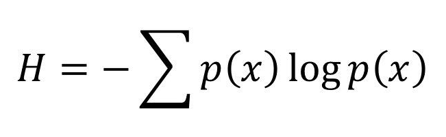
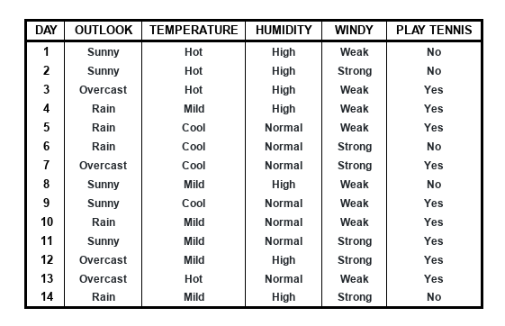

<h1 align="center"> DECISION TREE</h1>

<h2 align="center" id="0_2"> This repository is directed to the algorithms</h2>

 

### SUMÁRIO

 - [Introdução](#1)
 - [Conceitos básicos](#2)
 - [Fórmulas usadas](#3)
 - [Exemplo prático](#4)
 - [Algoritmos existentes]()

<!-- 
 - [Estatística I](./01-Estatistica_1/#0_1)
 - [Estatística II](./02-Estatistica_2/#0_1)
 - [Regressão Linear](./03-Regressao_linear/#0_1)
 - [Regressão Logística](./04-Regressao_logistica/#0_1)
 - [Séries Temporais](./05-Series_temporais/#0_1)
 - [Machine Learning](./06-Machine_learning/#0_1)
 - [Neural Networks e Deep Learning](./07-Neural_networks_e_deep_learning/#0_1)
 - [Grafos](./08-Grafos/#0_1)
 - [Mineração de Texto e processamento de linguagem natural](./09-Mineracao_texto_e_linguagem_natural/#0_1)
 - [Banco de Dados e Linguagem SQL](./10-Banco_de_dados_sql_e_noSql/#0_1)
 - [Fundamentos de gestão de projetos](./11-Fundamentos_de_gestao_de_projetos/#0_1) -->

 
<h1 align="center" id="1"> INTRODUÇÃO</h1>
 

 - A técnica de árvore de decisão consiste em mapear os possíveis resultados a partir de uma série de escolhas.

 - O algoritmo de árvore de decisão é aplicado para classificação ou regressão.

 - Se baseia na estratégia de dividir e conquistar.

 
<h1 align="center" id="2"> CONCEITOS BÁSICOS</h1>
 

A árvore é constituída por 4 características:

**Raiz:** É o atributo inicial da árvore, no qual tem o maior ganho de informação.
**Ramo:** São as possibilidade de decisão com base no atributo.
**Nó:** É representado pelo próximo atributo com maior ganho de informação.
**Folhas:** São as decisões finais, a classificação.

 
<h1 align="center" id="3">FÓRMULAS USADAS</h1>
 

<h3> ENTROPIA </h3>

Usado para medir o ganho de informação, o nível de ordem no produto.

A entropia de um conjunto pode ser definida como sendo o grau de pureza desse conjunto. Este conceito emprestado pela Teoria da Informação define a medida de "falta de informação", mais precisamente o número de bits necessários, em média, para representar a informação em falta, usando codificação óptima.

Dado um conjunto S, com instâncias pertencentes à classe i, com probabilidade pi, temos:

  

<h3> GANHO DE INFORMAÇÃO </h3>

O ganho (gain) é define a redução na entropia. Ganho(S,A) significa a redução esperada na entropia de S, ordenando pelo atributo A. O ganho é dado pela seguinte equação:

 
<h1 align="center" id="4">EXEMPLO PRÁTICO</h1>
 

Aqui veremos um exemplo real onde será demonstrado todos os passos feitos pela técnica *árvore de decisão*.

O problema consiste em sem saber se as condições climáticas estão propícias para jogar Tênis (**target: *PLAY TENNIS***), será um problema de **classificação** com base no histórico de dias no qual deram ou não para jogar tênis. A seguir temos a tabela:

  

**1° passo: Buscar qual é o atributo com maior ganho para ser a "Raiz" da árvore**

Inicialmente verificar qual o entropia da classe/target *PLAY TENNIS*:

S = [9+, 5-]
E = 0,940 = -(9/14)log2(9/14) -(5/14)log2(5/14)

Após, serão analisados todos os atributos para ver qual tem a melhor entropia.

Atenção: A coluna *DAY* não será usada por não tem influência sob a classificação.

PARA *HUMIDITY*:

 - Decisão *High*:
 - **[3+, 4-]**= -(3/7)log2(3/7) -(4/7)log2(4/7) = **0,985**

 - Decisão *Normal*:
 - **[6+, 1-]**= -(6/7)log2(6/7) -(1/7)log2(1/7) = **0,592**

PARA *OUTLOOK*:
**Gain(S, OUTLOOK)**

**Gain(S, HUMIDITY) = 0,940-**

Para *TEMPERATURE*:

Para *WINDY*:
